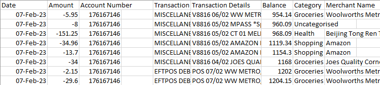
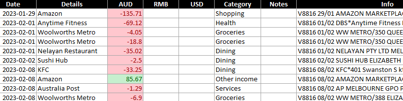
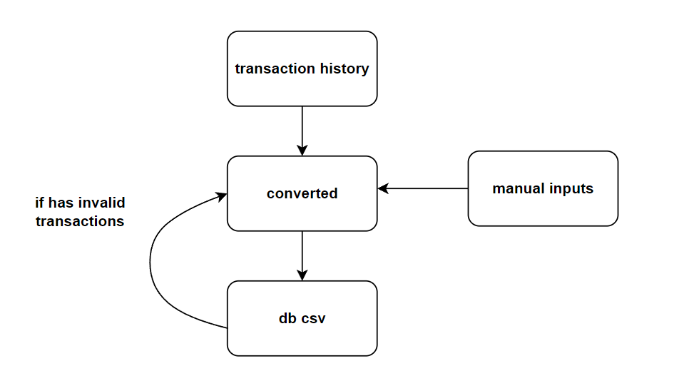

# Account Converter

Account converter transforms banks transactions history data and manual
inputs into a preset format. For example,

Nab transaction history:

Converted format:

## Process

1.  User downloads Transaction.csv from National Australia Bank Online
    Banking

2.  Account Converter converts Transaction.csv to `converted.xlsx.`

3.  User checks converted data and manually adds more data into
    `account.xlsx` if required.

4.  User saves converted into database (csv files)

- If invalid entries are found, then user should check converted data.

5.  `converted.xlsx` is now valid and can be used for book-keeping.

## Account Rules

`activity_rules.py` defines mappings in used when converting bank’s
transaction history.

MERCHANT_RULES is a dictionary that sets custom string for the field
“Details” in converted data, which are used to replace NAB's merchant
names. Key-value pairs should follow the format below:

    ‘Nab Merchant Name’: ‘Custom Details String’

For example,

>     merchant_rules = {
>
>     'the Lott': 'Lottery Purchase'
>
>     }

CATEGORY_RULES sets custom category names which are used to replace
corresponding NAB's category names. Key-value pairs should follow the
format below:

    ‘Nab Category Name’: ‘Custom Category Name’

For example,

>      category_rules = {
>
>     'Food & drink': 'Dining',
>
>     'Bills': 'Utilities'
>
>     }

merchant_category_rules defines how “Details” in converted data should
match categories. Key-value pairs should follow the format below:

    ‘Custom Details String’: ‘Custom Category’

For example,

>       merchant_category_rules = {
>
>     'the Lott': 'Investment',
>
>     'Medibank': 'Health',
>
>     'YouTube': 'Entertainment'
>
>       }

## Notes

- Date in NAB’s transaction history is not necessarily the actual date
  when the transaction occurred. The actual date is usually contained in
  the Info field. As a result, actual date is parsed from Info field if
  possible. If not, then Date field is used.

- Some transactions in NAB’s transaction history may not have Details,
  or some may have categories such as “Transfer In” that cannot be
  categorized programmatically. The users are expected to manually add
  or modify these transactions.

## Resource

- Python libraries: pandas, numpy, openpyxl
